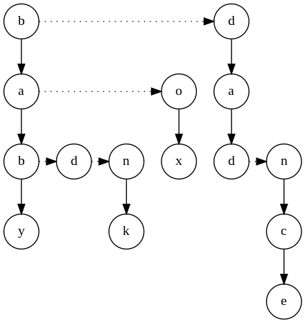

# Assignment 1
## Removing Invalid Parentheses - Algorithm
This part of the module addressess complex string manipulations with a focus on validating parentheses.

Problem statement:
    Given a string s that contains parentheses and lowercase letters, remove the minimum number of invalid parentheses to make the input string valid.

    A string is considered valid if and only if
        1) All opening parentheses '(' are closed with a ')'
        2) All closing parentheses ')' are closed with a '('
        3) Parentheses pairs are correctly nested

    Return an array [a, b] where
        `a` is the min number of removals required to make a string valid
        `b` is the list of all permutations of valid unique strings with min number of removals

### Example 1:
    Input: s = "())(()"
    Output: [2, ["()()"]]
    Explanation: Remove 2 parenthesis to make it valid

### Example 2:
    Input: s = "(a)())()"
    Output: [1, ["(a())()", "(a)()()"]]
    Explanation: Remove 1 parenthesis to make it valid

### Example 3:
    Input: s = ")("
    Output: [2, [""]]
    Explanation: The only way for it to be valid is to remove everything

## Solving the Problem
The process of solving this problem has quite a few challenges.

1) Combinatorial Explosion: The string has n parentheses, where $n$ is capped at $20$. This implies that there could possibly be $2^n$ possible subsets. The potential subsets grows exponentially as $n$ limits to infinity, so exhaustive search methods will be computationally expensive.

2) NP-Hard: The problem is categorized as NP-Hard, suggesting that its only solvable in a super-polynomial time. In other words, the problem cannot be solved quickly as the size of input increases.

3) Since we are unable to come up with an optimized algorithm for this, we can really only apply a brute force approach, which can be impractical for lengthy strings.

## My Solution
After discussing that the problem is indeed $hard$, we will result in using an optimized brute force approach.

1) Recursive brute force (Dynamic Programming): I implemented a method that tries removing parenthesis and checks for validity at every index of the string.

2) Branch Pruning: The recursion stops early when a valid string is found, since we know that thats the minimum number of required removals

3) Efficiently checking for validity: A very common yet efficient method to check for validity, is to use a counting method as shown in the function

## Functions

### generateRandomString()
    Generates a random string consisting mostly of parentheses, and less lowercase letters.
    Useful for testing other functions.
```
let randomstr = generateRandomString();
console.log(randomstr);

// prints out the random string
```

### isValid(s)
    Checks if string s is valid/has balanced parentheses.
    Can be used in removeInValidParentheses function to check validity.
```
console.log(isValid("()"));       // true
console.log(isValid("(()"));      // false
console.log(isValid("()()"));     // true
console.log(isValid("(())"));     // true
console.log(isValid(")("));       // false
```

### removeInvalidParentheses(s)
    Removes minimum number of parentheses to make s a valid string.
```
console.log(removeInvalidParentheses("())(()"));  // Output: [2, ["()()"]]

console.log(removeInvalidParentheses("(a)())()"));  // Output: [1, ["(a())()", "(a)()()"]]

console.log(removeInvalidParentheses(")("));  // Output: [2, [""]]
```


## Trie - data structure
This part of the module addresses the problem when storing large amount of strings, this goes more into the idea of data structures rather than algorithms as discussed in the previous section.

Suppose that we wish to store and check if a particular string exists.
Here are a few data structures we can use:

Let $n$ be the number of strings, and $l$ to be the expected string length
### Arrays of Arrays
Time complexity: $O(n)$

Space complexity: $O(n * l)$

### Hash Maps
Time complexity: $O(l)$, unlike numbers, every char in a string needs to be processed once to their respective hashes, thus hashing strings are non-trivial

Space complexity: $O(n * l)$

### Binary Trees
Time complexity: $O(l * logn)$

Space complexity: $O(n * l)$

## My solution - using a Trie
    A trie is a specialized data structure that provides a balanced of time and space efficiency specfically for storing strings.
   


Time complexity: $O(l)$, since the trie just has to go through the string once

Space complexity:
Worst case: $O(n * k)$, where k is the length of the longest string

Average case: $O(k)$

## Functions

### add(word)
    Inserts a word into the trie. Every node in the trie is represented by a character.
```
trie.add("cat");
trie.add("can");
// Both "cat" and "can" will be added to the trie. "ca" will be the common first prefix shared between both words.
```

### search(word)
    Searches for the input word inside the trie and returns a boolean, indicating if the string exists
```
console.log(trie.search("cat"));  // true
console.log(trie.search("cap"));  // false
```

### remove(word)
    Removes the input word from the trie, and any corresponding leftover prefixes
```
trie.add('test');
trie.add('testing');
trie.search('test');    // true
trie.search('testing'); // true
trie.remove('test');
trie.search('test')     // false
trie.search('testing'); // true
```